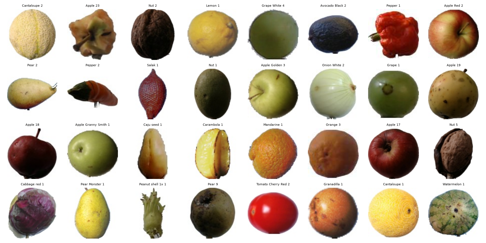
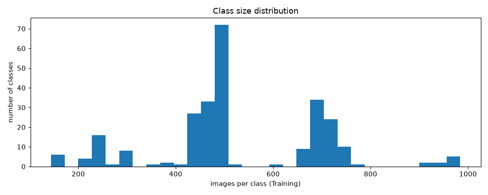
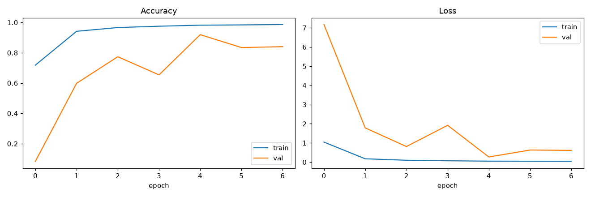
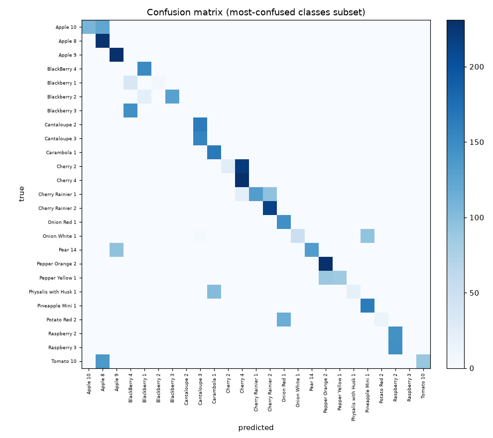
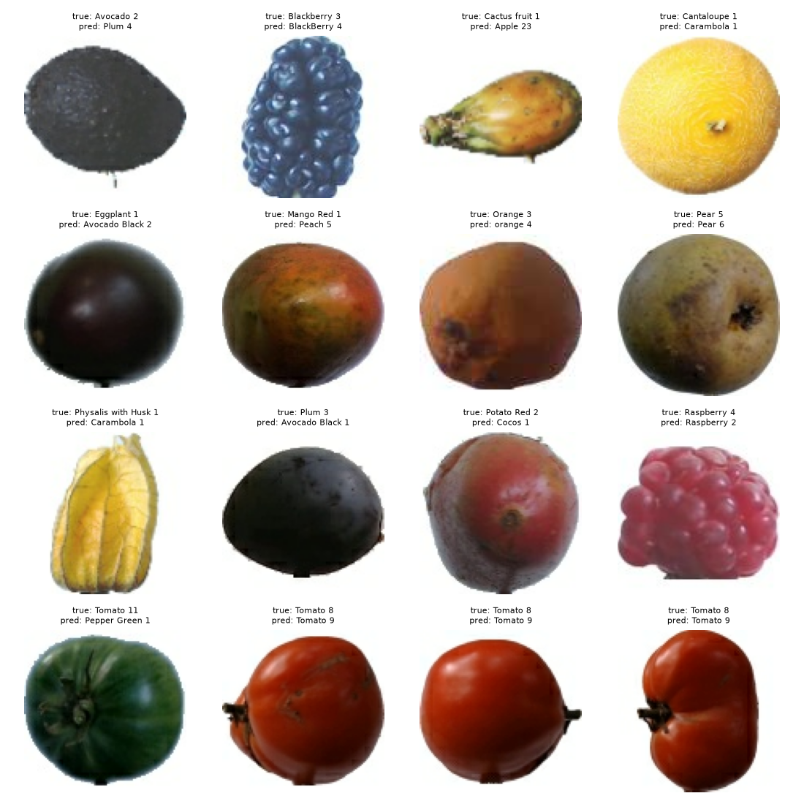
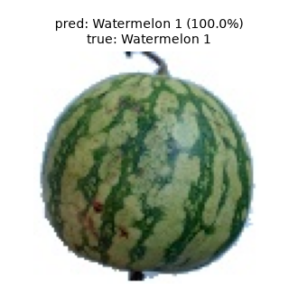

# fruit-match

CNN image classifier for the Fruits 360 dataset — trains a custom convolutional
network from scratch and compares it against a MobileNetV2 transfer-learning
baseline, end to end in a single Jupyter notebook.



## Dataset

[Fruits 360 on Kaggle](https://www.kaggle.com/datasets/moltean/fruits) (moltean/fruits).
This project uses the `fruits-360_100x100` variant:

- **260 classes** (fruits, vegetables, nuts, seeds — including multiple cultivars of
  the same fruit, e.g. 20+ Apple varieties)
- **137,221 training images / 45,724 test images**
- 100x100 px RGB, white background, pre-cropped, single centered object per image

Class sizes aren't perfectly balanced — roughly a 7x spread between the smallest and
largest class:



## Setup

```
python3 -m venv .venv && source .venv/bin/activate  # or use your Python 3.12 install directly
pip install -r requirements.txt
jupyter notebook notebooks/fruit_classifier.ipynb
```

Requires Python 3.12 (TensorFlow does not yet support the latest Python releases).

## Local dataset

Dataset files are already provided locally and are **not** committed to this repo (see `.gitignore`). Place (or symlink) the `fruits-360` folder — containing `Training/` and `Test/` subfolders — at:

```
data/fruits-360/
```

No Kaggle API download step is needed in the notebook since the data is already on hand.

## Approach

**Pipeline** — `tf.data`, built from `keras.utils.image_dataset_from_directory`:
- Deterministic 90/10 train/validation split carved from `Training/` (seeded), plus
  the dataset's own `Test/` split held out entirely for final evaluation
- Raw decoded images are cached first (small, ~4GB for the full training set), *then*
  normalized and augmented on the fly — augmentation (`RandomFlip`, `RandomRotation`,
  `RandomZoom`) is applied to the training split only, and freshly re-randomized every
  epoch since it happens after the cache, not before it

**Baseline CNN** — a from-scratch Conv2D/BatchNorm/MaxPooling stack, 523K params:

```
Input (100,100,3)
 → [Conv2D 32  → BatchNorm → MaxPool]
 → [Conv2D 64  → BatchNorm → MaxPool]
 → [Conv2D 128 → BatchNorm → MaxPool]
 → [Conv2D 256 → BatchNorm]
 → GlobalAveragePooling2D
 → Dense 256 → Dropout 0.3
 → Dense 260 (softmax)
```

Global average pooling instead of `Flatten` keeps the parameter count down given 260
output classes — a naive flatten into a large dense head would dwarf the conv layers.

**Transfer learning** — a frozen ImageNet-pretrained MobileNetV2 backbone (2.6M
params total, only the head is trainable) as a stretch-goal comparison.

**Training** — categorical cross-entropy, Adam, early stopping + checkpointing on
`val_accuracy`. Both models trained CPU-only (Apple M1 Pro, no GPU — tensorflow-metal
proved incompatible with Python 3.12 during setup, so this ran on plain CPU TensorFlow).

## Model artifacts

Running the notebook saves trained model checkpoints to `models/` (`baseline_cnn.keras`,
`mobilenetv2_transfer.keras`) via `ModelCheckpoint`. This folder is **not** committed
(see `.gitignore` — `*.keras` and `models/` are both excluded) since checkpoints are
large binaries; re-run the notebook to regenerate them.

## Results

Full details, per-class precision/recall/F1, and the complete confusion matrix are in
[notebooks/fruit_classifier.ipynb](notebooks/fruit_classifier.ipynb).

| Model | Test accuracy | Params | Train time (CPU, Apple M1 Pro) |
|---|---|---|---|
| Baseline CNN (from scratch) | 88.81% | 522,948 | ~10.3 hours |
| MobileNetV2 (transfer learning) | 94.81% | 2,591,044 | ~2.1 hours |

Neither model quite hit the >=95% test accuracy target on this run — training was
CPU-only (no GPU), so both runs were cut off by early stopping / a fixed epoch budget
rather than run to full convergence. The transfer-learning result — nearly 6 points
higher in about a fifth of the training time — suggests the target is reachable with
more training budget (more epochs, unfreezing and fine-tuning the backbone), not a
different approach.

**Training curves (baseline CNN):**



**Confusion matrix (most-confused classes subset, baseline CNN):**



Misclassifications concentrate almost entirely on fine-grained cultivar pairs of the
same fruit (different Apple/Grape/Tomato varieties that differ mainly in subtle color
or shade), not across unrelated classes — the model's mistakes are visually
reasonable, not random:



**Inference demo** — classifying a held-out test image:



## Limitations

- Fruits-360 images are studio-quality: centered, single object, uniform white
  background. This model has **not** been validated on real-world photos (natural
  backgrounds, multiple objects, varied lighting/angle) and should not be treated as
  production-ready for that setting without further data and evaluation.
- No hyperparameter search was performed — architecture and training settings were
  chosen manually and pragmatically, not tuned exhaustively.
- Class sizes vary ~7x across the 260 categories; no class-balancing (oversampling/
  class weights) was applied.
- No deployment (API/web app) or mobile inference optimization — notebook only.
